---
### Storage

> 저장소는 크게 3가지 종류가 있다.

##### 1. Onpremise Storage

- DAS(Direct Attache Storage)
	→ 물리적인 전송 매체(IDE, SATA, SCASI)를 이용해서 Storage를 직접적으로 연결
	- 장점: 속도가 빠름, 비용이 저렴, 안정적
	- 단점: 원거리 구성 불가, 확장도 제한적
- NAS(Network Area Storage)
	→ 기존 네트워크 환경(100Mbps, 1Gbps)을 이용해서 Storage를 연결
	- 장점: 구성 용이, 비용 저렴, 원거리 구성 가능
	- 단점: 속도가 느림, 네트워크에 병목 현상이 발생
- SAN(Storage Area Network)
	→ Storage영역에 별도의 Network 구성, Fiber Channel
	- 장점: 속도가 빠름(16Gbps), 안정적, 원거리 구성 가능
	- 단점: 고가의 비용, 구성이 쉽지 않음(별도의 SAN Switch, HBA Card)

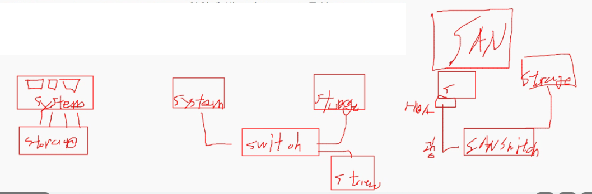


##### 2. Cloud Storage

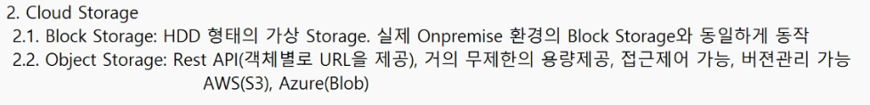

---

### DISK

##### 1. DISK 사용 절차

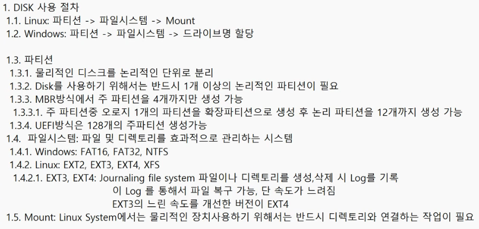

1.4 파일시스템: 파일 및 디렉토리를 효과적으로 관리하는 시스템
1.4.1 Windows: FAT16, FAT32, NTFS
1.4.2 Linux: EXT2, EXT3, EXT4, XFS
1.4.2.1 EXT3, EXT4: Journaling file system 파일이나 디렉토리를 생성, 삭제 시 Log를 기록 이 Log를 통해서 파일 복구 가능, 단 속도가 느려짐
ext3의 느린 속도를 개선한 버전이 ext4

1.5 Mount: Linux System에서는 물리적인 장치 사용하기 위해서는 반드시 디렉토리와 연결하는 작업이 필요

mount에 사용되는 디렉토리를 Mount point


```bash
lsblk
```

sd: 스카시방식
hd: 
sr0: cdrom
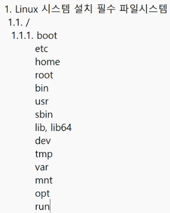

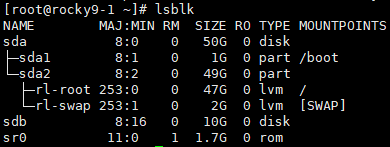

하나의 sector 크기는 512byte

##### 1. 3GB
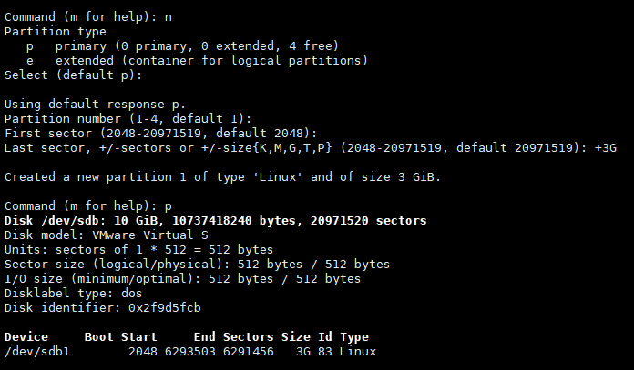

##### 2. 7GB
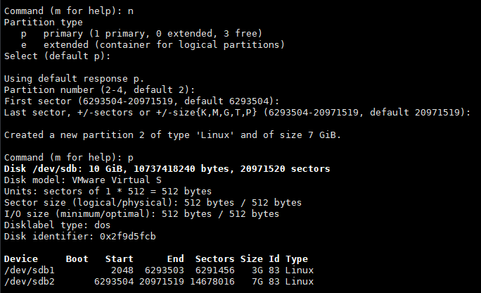


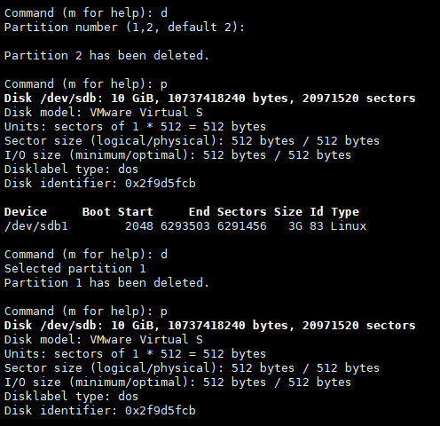

파티션을 지우면 안에있는 데이터는 다 날라감


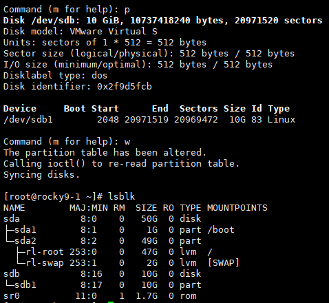


---
### 파일 시스템

df: 파일시스템의 사용률
du: 디스크 사용률

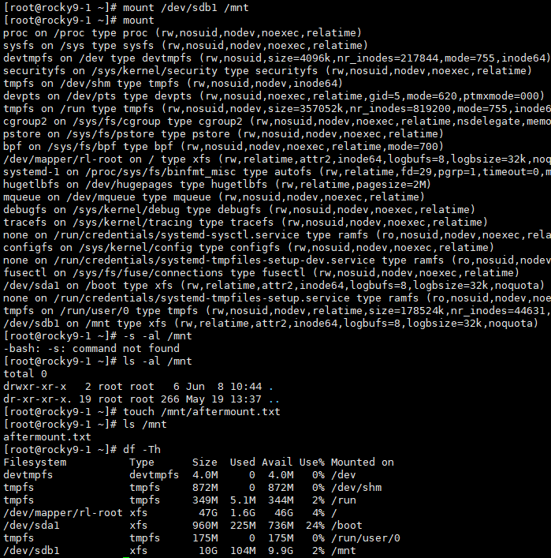

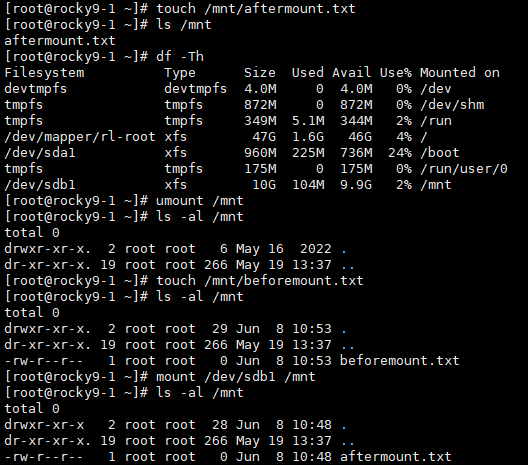

mount -> 용량 문제 한계 -> lvm 도입 -> 용량 늘리기 쉬움

삭제

파일 시그니처가 남아있는걸 고려

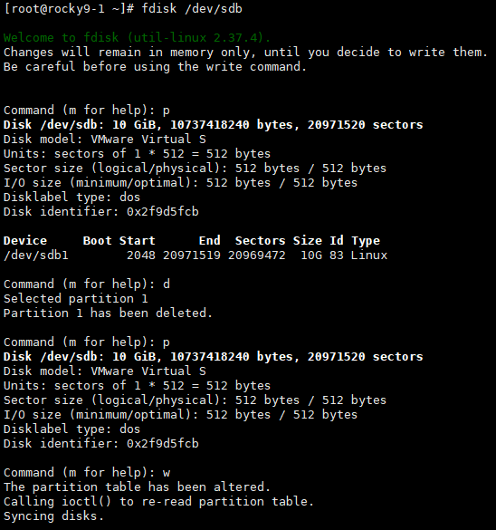

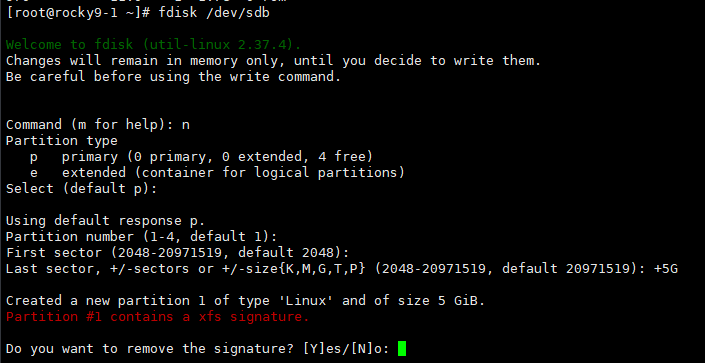

Y누르면 시그니처 삭제가능

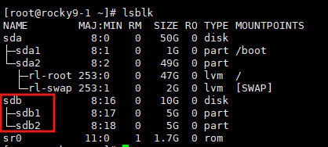


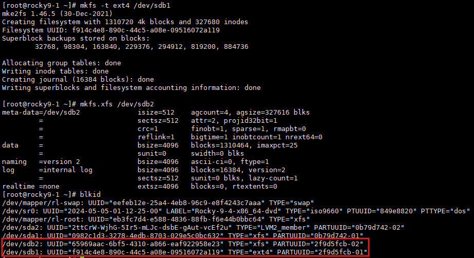

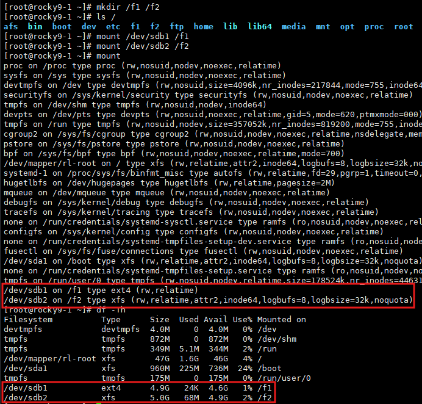

mount, de -Th 로 확인가능

삭제순서
umount /dev/sdb1 -> wipefs -a -f /dev/sdb1

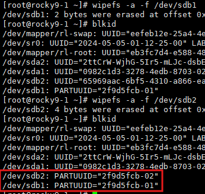

---
exam1

1. sdb 디스크를 3개의 파티션으로 분리

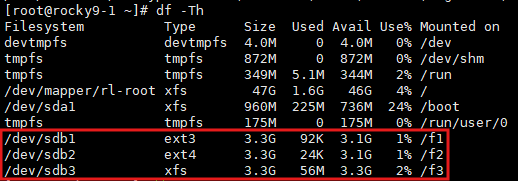

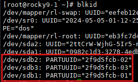

이렇게 뜨면 삭제완료