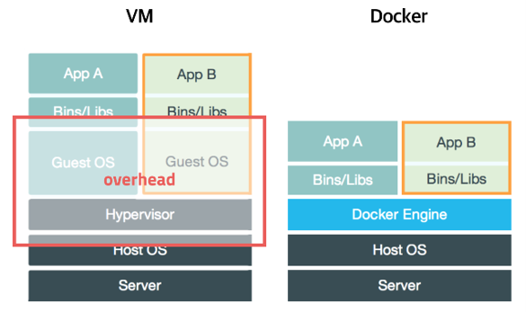
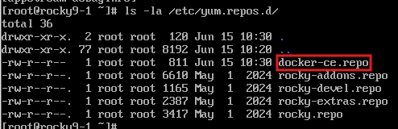

---
Docker: docker.io, hub.docker.com
쿠버네티스: 


commutication edi: 무료



Docker는 Guest OS를 사용하지않아 CPU 메모리 사용X
Host OS는 linux

gcp는 전부 container로 운영
웹서버는 메모리 많이 잡아먹음 -> 내부에 5개의 프로세스들이 움직이는중

jail: 제한풀어버리는기술


```bash
dnf -y install dnf-plugins-core
dnf config-manager --add-repo https://download.docker.com/linux/centos/docker-ce.repo
```



	docker-ce.repo 존재여부확인 후 설치진행

```bash
dnf -y install docker-ce docker-ce-cli containerd.io docker-buildx-plugin docker-compose-plugin
```


1. repository: Linux 개발회사에서 운영하는 인터넷 상의 저장소
주로 package들이 이곳에 존재
dnf or apt, zypper 등의 명령어를 사용해서 다운로드함

2. package 설치 방법
- source 설치(Binary설치): 커스터마이징 가능(의존성 문제를 해결해야 함)
- rpm 설치: rpm 파일 다운로드 후 설치
- yum, dnf 설치: repository에서 rpm파일 다운로드 후 설치, 의존성 문제까지 해결
	인터넷 연결, 최신버전은 아님(개발사에서 올려놓은걸 다운로드하는 방식)
	커스터마이징 불가능

