---

apache.org

hadoop 빅데이터 시스템?

하둡 에코시스템 (Hadoop EcoSystem)

bz2 > gz 30%

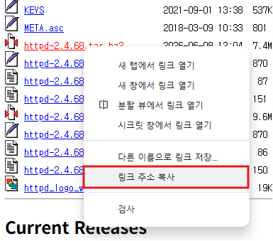

https://downloads.apache.org/httpd/httpd-2.4.68.tar.bz2

docker -> iptables 설치됨 브릿지 연결 -> 자동 포트 오픈


dnf install -y wget, bzip2, tar


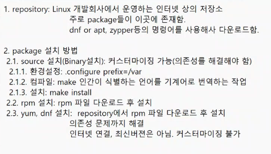

유닉스 x86 돌아감 -> linux

https://downloads.apache.org/apr/apr-1.7.6.tar.bz2
https://downloads.apache.org/apr/apr-1.7.6.tar.gz

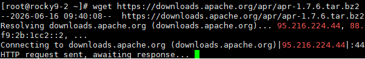

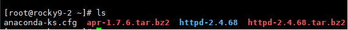

https://downloads.apache.org/apr/apr-util-1.6.3.tar.bz2
https://downloads.apache.org/apr/apr-util-1.6.3.tar.gz

tar xvfj로 압축해제

```bash
   ./configure --prefix=/apr
   make
   make install
```

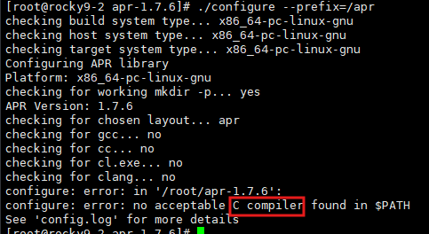

dnf install -y gcc

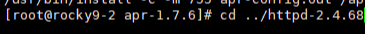

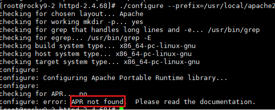

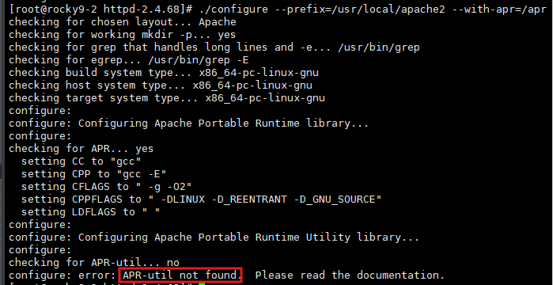

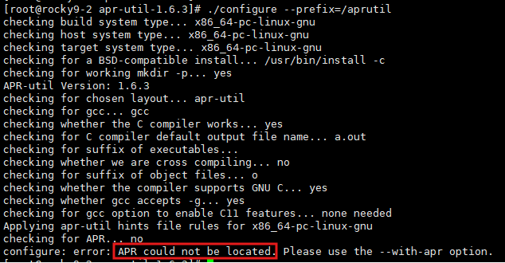

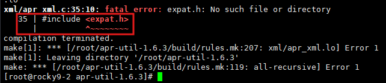

	make 시 오류 생김 -> 나중에 큰 문제생김

dns install -y expat-devel


--> apr, apr-util 완료


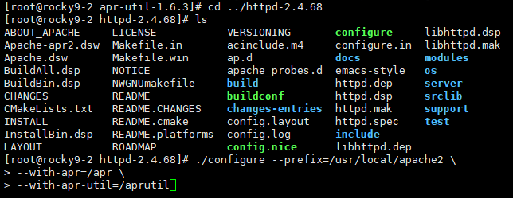

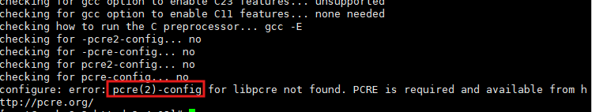

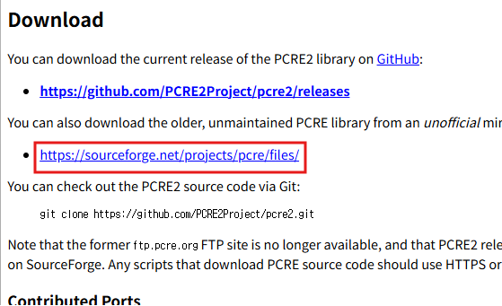

	pcre.org -> pcre -> 8.45 -> pcre-8.45.tar.bz2 (링크주소복사)
	뒤에 /download가 붙을거임 그거 지우고 wget


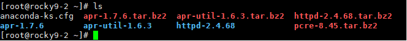

	tar xvfj pcre-..
	./configure --prefix=/pcre

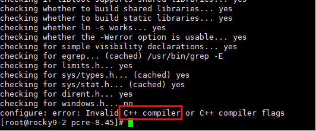
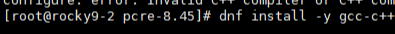

	c++도 설치

make && make install: make성공 시 make install 실행
make || make install: make 실패시 make install 실행
make; make install: make 끝나면 성공/실패 유무 상관없이 make install


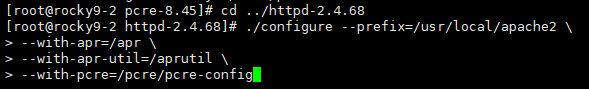

	왜 없지 -> 경로잘못됨

https://downloads.apache.org/httpd/httpd-2.4.68.tar.bz2
https://downloads.apache.org/httpd/httpd-2.4.68.tar.gz


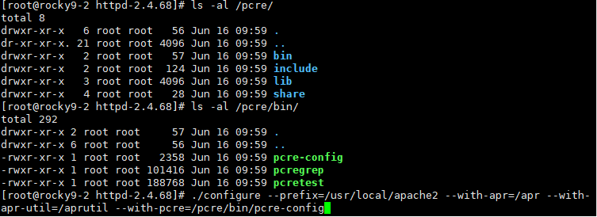

	make && make install 실행

https://sourceforge.net/projects/pcre/files/pcre/8.45/pcre-8.45.tar.bz2
https://sourceforge.net/projects/pcre/files/pcre/8.45/pcre-8.45.tar.gz

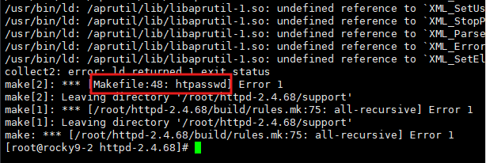

	expat-devel을 나중에 설치해서 생기는 문제 -> 젤 먼저 설치해야 함


---

다시

```bash
dnf install -y wget tar gcc gcc-c++ expat-devel
```


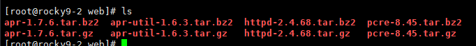
./configure --prefix=/web/apr
./configure --prefix=/web/aprutil --with-apr=/web/apr
./configure --prefix=/web/pcre
./configure --prefix=/usr/local/apache2 --with-apr=/web/apr --with-apr-util=/web/aprutil --with-apr=/web/pcre/bin/pcre-config

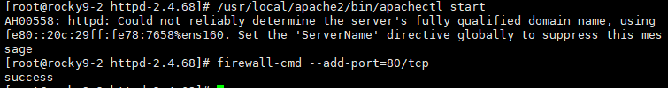

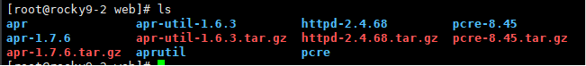


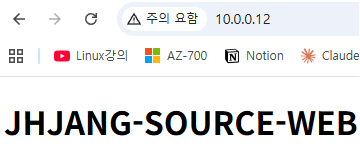


##### 환경변수 설정
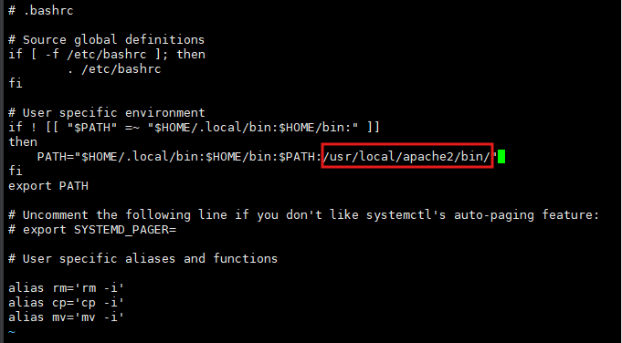

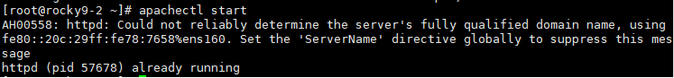

경로 지정없이 바로 시작 가능