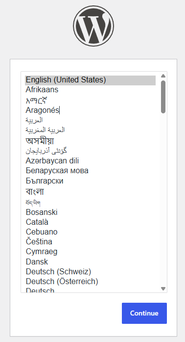
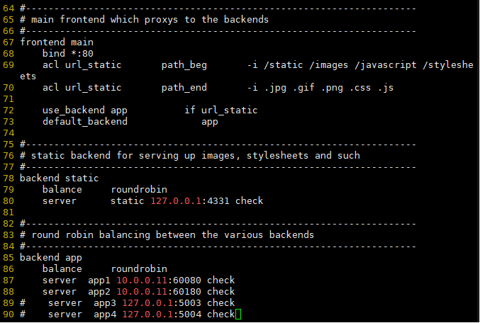
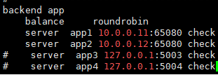
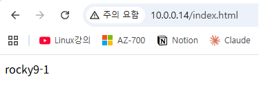
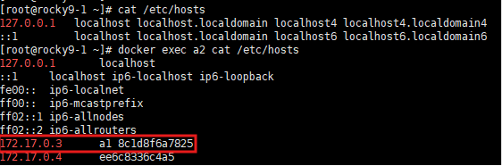
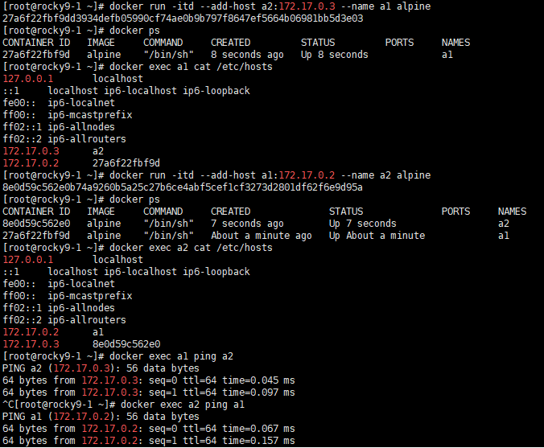

---

## docker 설치

##### rocky 9-3
```bash
dnf -y install dnf-plugins-core
dnf config-manager --add-repo https://download.docker.com/linux/centos/docker-ce.repo
dnf -y install docker-ce docker-ce-cli containerd.io docker-buildx-plugin docker-compose-plugin
systemctl enable --now docker
docker load -i all.tar
```

##### rocky 9-1
```bash
docker save -o all.tar alpine busybox httpd mysql:8.0 nginx rockylinux/rockylinux wordpress
scp all.tar root@10.0.0.13:/root/
```

---

## mysql 접속

##### rocky9-1
```bash
docker run -itd -e MYSQL_ROOT_PASSWORD=It12345! -e MYSQL_DATASE=word --name m1 mysql:8.0
mysql -uroot -pIt12345! -h 172.17.0.2

docker run -itd -p 60080:80 \ -e WORDPRESS_DB_HOST=172.17.0.2 \ -e WORDPRESS_DB_USER=root \ -e WORDPRESS_DB_PASSWORD=It12345! \ -e WORDPRESS_DB_NAME=word \ --name w1 wordpress

docker run -itd -p 60180:80 \ -e WORDPRESS_DB_HOST=172.17.0.2 \ -e WORDPRESS_DB_USER=root \ -e WORDPRESS_DB_PASSWORD=It12345! \ -e WORDPRESS_DB_NAME=word \ --name w2 wordpress

docker exec w1 ls -al /var/www/html/ #index.html이 있다면 dnf로 설치한거

vi index.html
vi index1.html

docker cp index.html w1:/var/www/html/
docker cp index1.html w2:/var/www/html/index.html/
```




---

## HAProxy 설정

> 0.0.0.11:60080 이라 적는게 너무 싫음 -> HAProxy사용하면됨

##### rocky9-4
```bash
vi /etc/haproxy/haproxy.cfg
systemctl start haproxy
firewall-cmd --add-port=80/tcp
```



---


##### rocky9-1, rocky9-2
```bash
docker rm -f $(docker ps -aq)
docker ps
docker run -itd -p 65080:80 -e WORDPRESS_DB_HOST=10.0.0.13 -e WORDPRESS_DB_USER=root -e WORDPRESS_DB_PASSWORD=It12345! -e WORDPRESS_DB_NAME=word --name w1 wordpress
```

##### rocky9-3
```bash
docker run -itd --net host -e MYSQL_ROOT_PASSWORD=It12345! -e MYSQL_DATABASE=word --name m1 mysql:8.0
docker ps
firewall-cmd --add-port=3306/tcp
```


##### rocky9-4
```bash
vi /etc/haproxy/haproxy.cfg
systemctl restart haproxy
```




@ 번외 @
```bash
docker exec w1 sh -c "echo $HOSTNAME > /var/www/html/index.html"
```




로드밸런서 기능 수행 확인

---
## docker 네트워크

##### rocky9-1
```bash
docker run -itd --name a1 alpine
docker run -itd --link a1 --name a2 alpine
docker ps
docker exec a2 ping a1 #핑이 됨 /etc/hosts에 등록되었기 때문
docker exec a2 cat /etc/hosts
```



/etc/hosts에 a1이 등록되었기 때문에 핑이 됨


## 양방향 핑 테스트

```bash
docker run -itd --add-host a2:172.17.0.3 --name a1 alpine
docker exec a1 cat /etc/hosts

docker run -itd --add-host a1:172.17.0.2 --name a2 alpine
docker exec a2 cat /etc/hosts

docker exec a1 ping a2
docker exec a2 ping a1
```


---

## docker volume

```bash
docker volume
docker volume ls
docker volume create www
ls -al /var/lib/docker/volume/www/_data
docker run -itd -v www:/test --name a1 alpine
touch /var/lib/docker/volumes/www/_data/test.txt #host에 만들어도 마운트되서 container에도 만들어짐
cat >> /var/lib/docker/volumes/www/_data/test.txt << eof
cat /var/lib/docker/volumes/www/_data/test.txt << eof
cat /var/lib/docker/volumes/www/_data/test.txt
docker exec -it a1 /bin/sh
cat /var/lib/docker/volumes/www/_data/test.txt
docker rm -f a1
ls /var/lib/docker/volumes/www/_data/

docker volume ls
docker volume rm www
docker volume ls
```


---

## volume 설정

```bash
docker run -itd -p 60080:80 -v www:/usr/local/apache2/htdocs --name h1 httpd
vi /var/lib/docker/volumes/www/_data/index.html

docker run -itd -p 60180:80 --volumes-from h1 --name h2 httpd

docker ps
```


---

## mysql 권한

```bash
grant all privileges on *.* to 'jhjang'@'%';
```