---

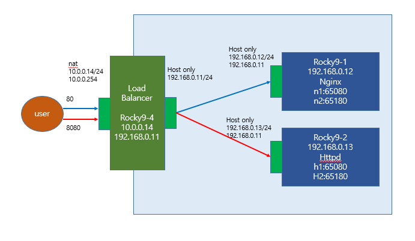

### rocky9-4
```bash
vi /etc/haproxy/haproxy.cfg
systemctl restart haproxy
ss -nat
firewall-cmd --add-port={80,8080}/tcp
firewall-cmd --list-all
```

ip설정 확인
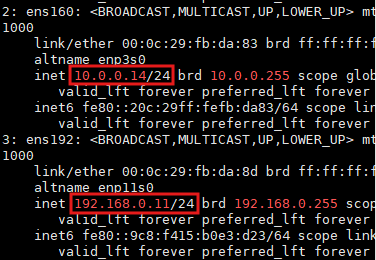

rocky9-1 확인
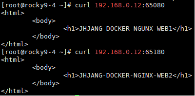

rocky9-2 확인
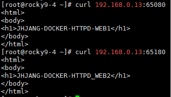

vi /etc/haproxy/haproxy.cfg
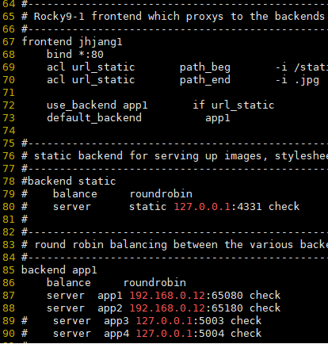

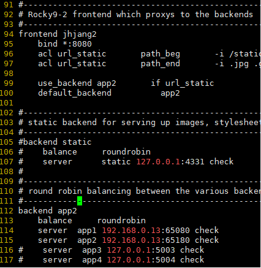

ss -nat
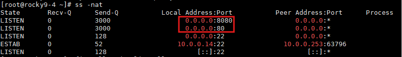

로드밸런싱 확인


### rocky9-1
```bash
nmtui #ip주소 수정
systemctl restart docker

docker images
docker run -itd -p 65080:80 --name n1 nginx
docker run -itd -p 65180:80 --name n2 nginx
docker ps -a

vi index1.html
vi index2.html

docker cp index1.html n1:/usr/share/nginx/html/index.html
docker cp index2.html n2:/usr/share/nginx/html/index.html
```

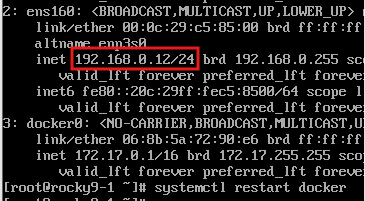

### rocky9-2
```bash
nmtui
systemctl restart docker

docker images
docker run -itd -p 65080:80 --name h1 httpd
docker run -itd -p 65180:80 --name h2 httpd

vi index1.html
vi index2.html

docker cp index1.html h1:/usr/local/apache2/htdocs/index.html
docker cp index2.html h2:/usr/local/apache2/htdocs/index.html
```

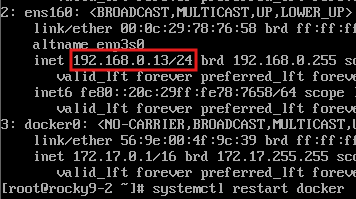


---

# Dockerfile

컨테이너는 프로세스 단위로 동작함
컨테이너는 기본적으로 하나의 프로세스만 실행됨
/bin/bash 실행 후 httpd 실행이 될까? -> NO

```bash
mkdir /http
cd /http/
vi Dockerfile #무조건 Dockerfile이름 써야함
docker build -t jhjang/http:1.0 .

docker images
docker run -itd -p 60080:80 --name sh1 jhjang/http:1.0
docker ps -a
```

vi Dockerfile
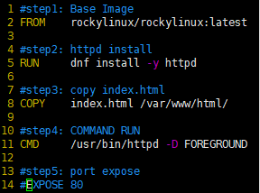

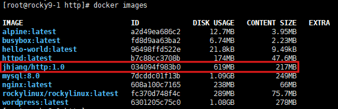