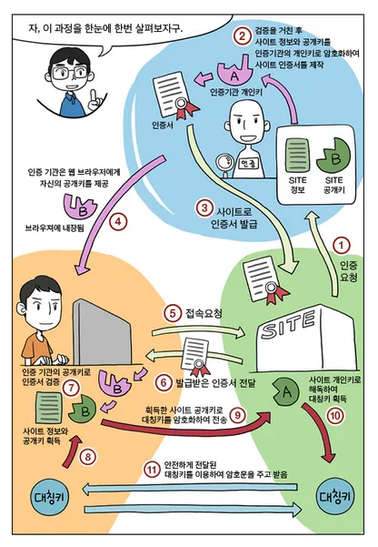
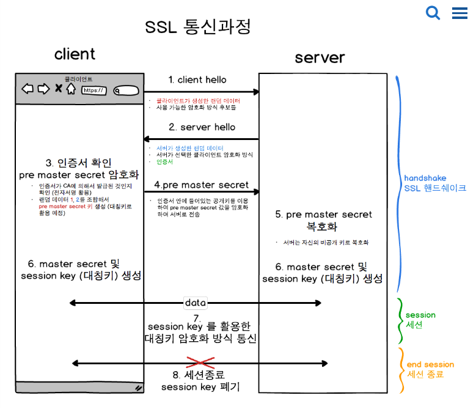

---





ssl 사용 이유
- 종단 간 신뢰성 확보
- 암호화 통신

사설 인증서
- 종단 간 신뢰성 확보 불가

```bash
openssl genrsa -out ca.key 2048
openssl req -new -key ca.key -out ca.csr
openssl x509 -req -days 365 -in ca.csr -signkey ca.key -out ca.crt
cp ca.crt /etc/pki/tls/certs/
cp ca.key /etc/pki/tls/private/
dnf install -y httpd
vi index.html
```