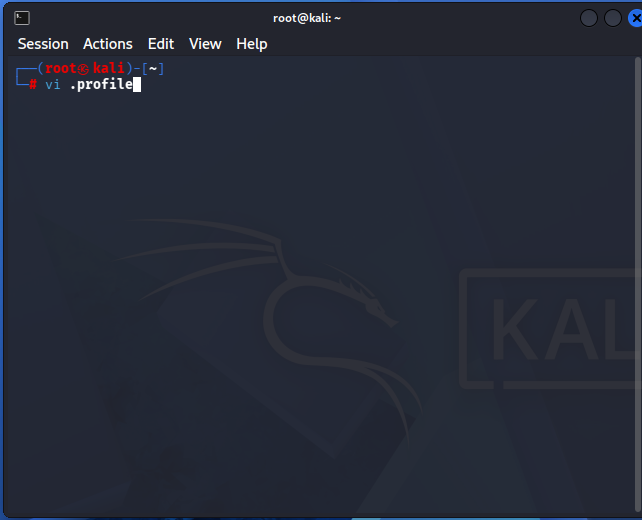

---
## Kali Linux 2026.1 설치 가이드 <3>

**한글화**


```bash
sudo passwd root
# 자신 계정 비번
# root 비번 설정
# root 비번 재입력
reboot
```


	root로 로그인

```bash
sudo apt install -y ibus ibus-hangul fonts-nanum*
reboot
```


	root 계정으로 접속





	배경화면뿐만 아니라 한글까지 잘 되는걸 볼 수 있다.

