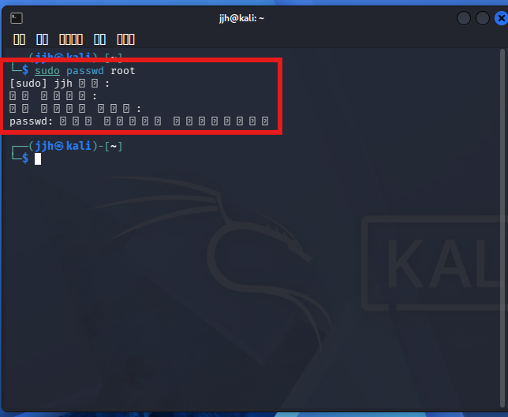
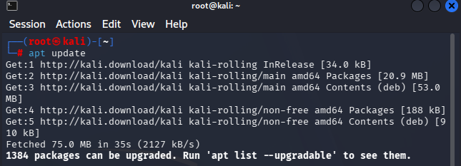
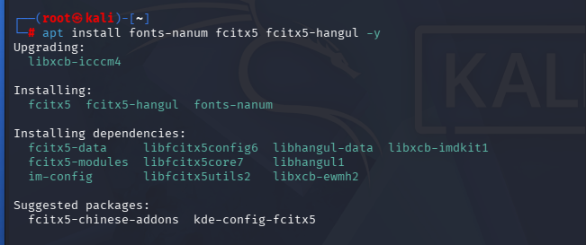
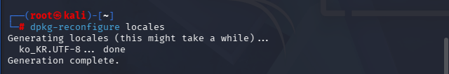
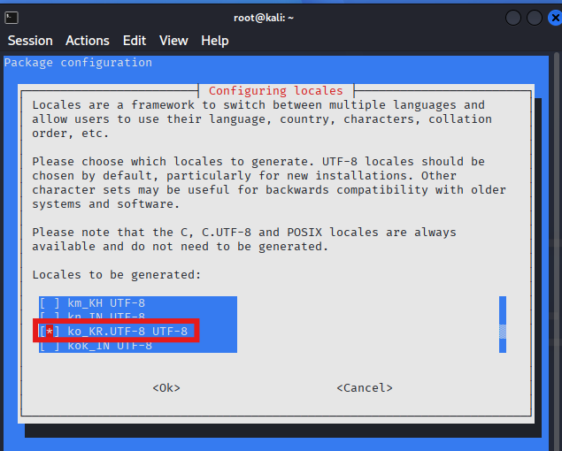
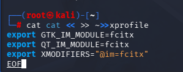
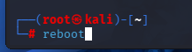

---
## Kali Linux 2026.1 설치 가이드 <3>

**한글화**




	먼저 칼리에 들어오면 root 비번부터 설정해준다 그리고 재부팅 후 root로 로그인




	2026.1 버전부터는 update를 하지 않으면 한글화가 안되는 것 같다.








	체크하고 OK



```bash
cat << EOF >> ~/.xprofile
export GTK_IM_MODULE=fcitx
export QT_IM_MODULE=fcitx
export XMODIFIERS="@im=fcitx"
EOF
```

	코드를 그대로 복사해서 붙여넣기



	그리고 reboot


