---
## Kali Linux 2026.1 설치 가이드 <3>

**한글화**

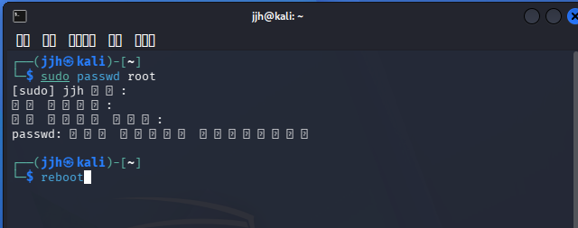

```bash
sudo passwd root
# 자신 계정 비번
# root 비번 설정
# root 비번 재입력
reboot
```

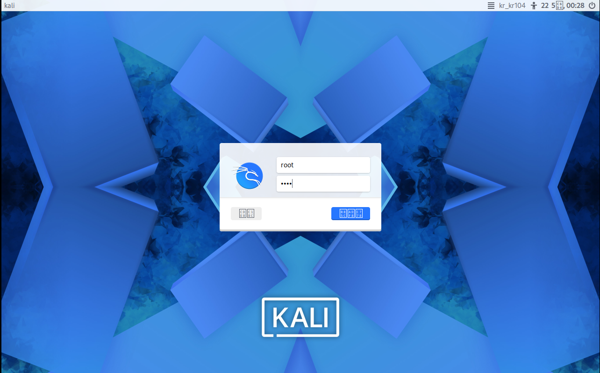

	root로 로그인

```bash
sudo apt install -y ibus ibus-hangul fonts-nanum*
reboot
```

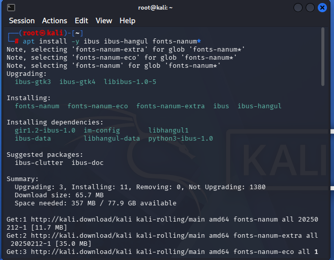

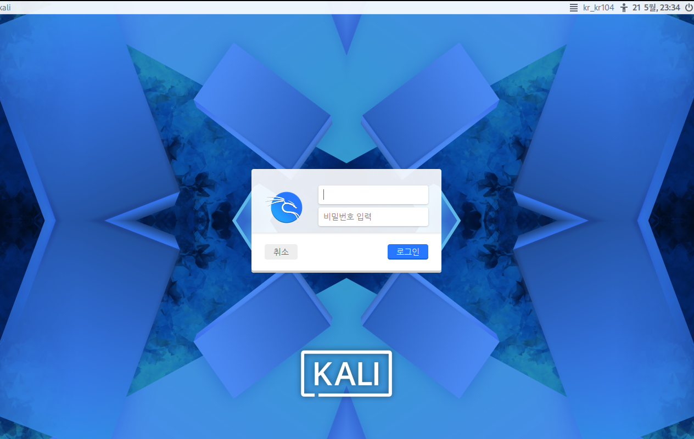

	root 계정으로 접속

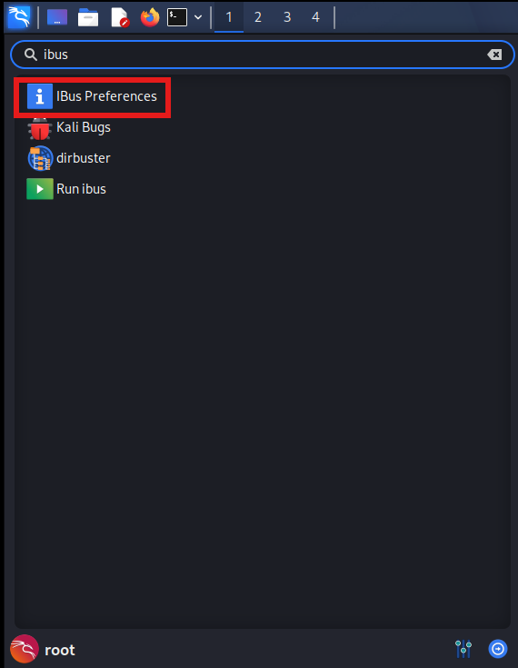

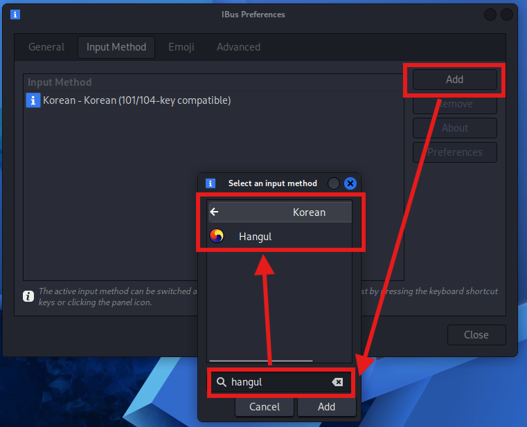


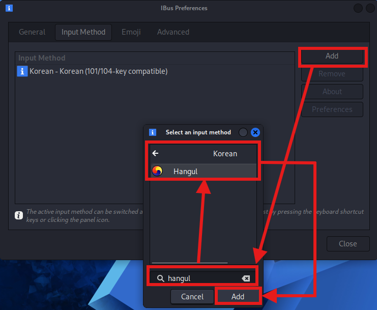

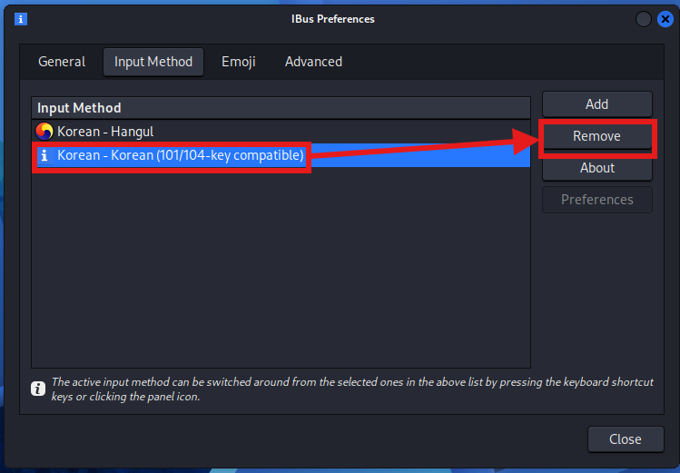

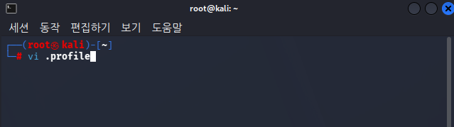

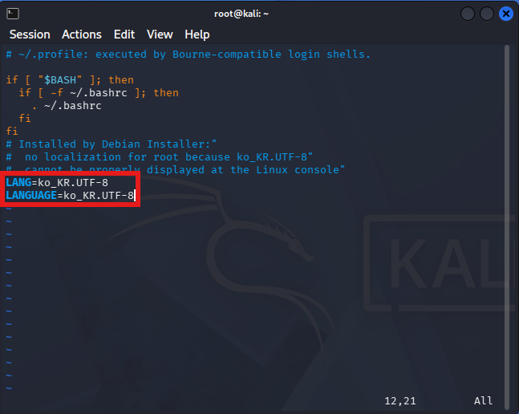

	vi 사용법
	키보드 i 입력 -> 방향키 아래 -> 기존에 있던 C지우고 ko_KR.UTF-8 넣기
	-> esc -> 키보드 :wq 입력
	i : insert 모드 (편집 가능하다)
	:wq : 저장

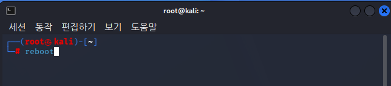

	reboot 해주기

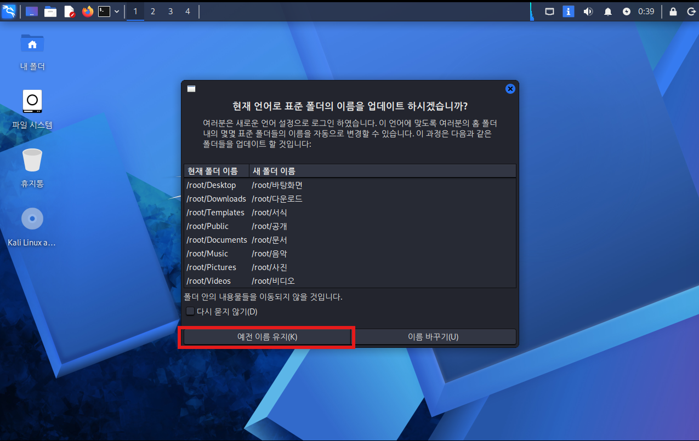

	한글 폰트로 바뀐걸 확인 가능하다
	예전 이름 유지를 선택한다. (바꾸면 실습하기 힘들어짐)

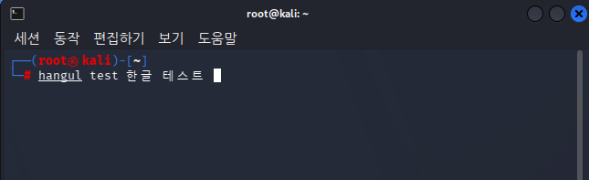

	한글도 안깨지고 잘 입력되는걸 볼 수 있다.
	(vi로 .profile 수정안하면 한글 깨짐)


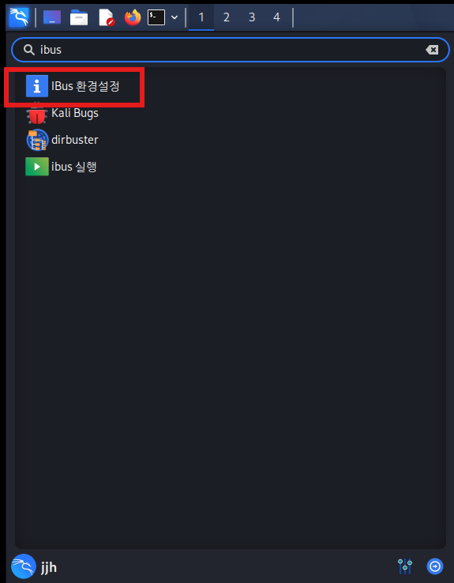

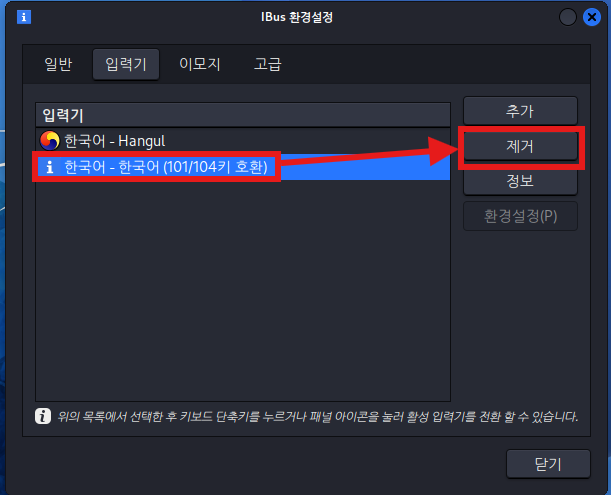

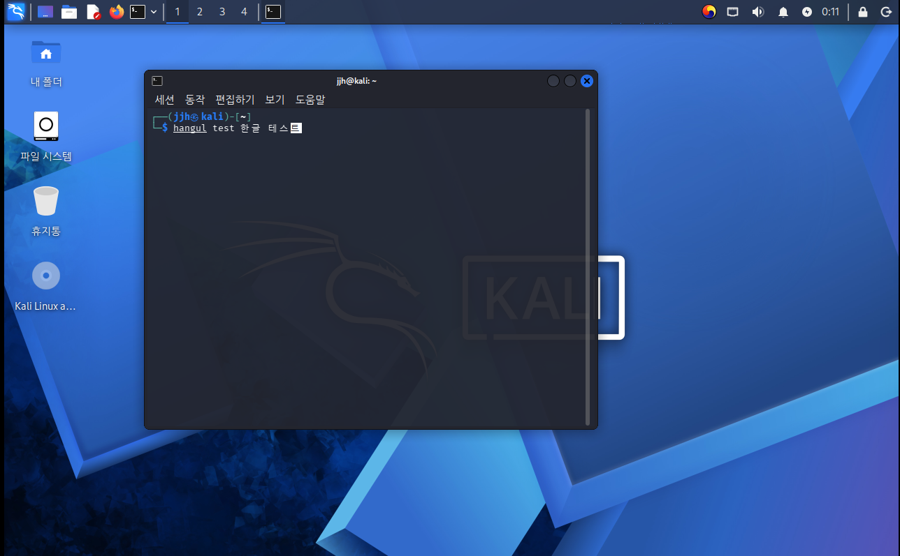

	배경화면뿐만 아니라 한글까지 잘 되는걸 볼 수 있다.


---
**일반계정의 root폴더 영문화?**

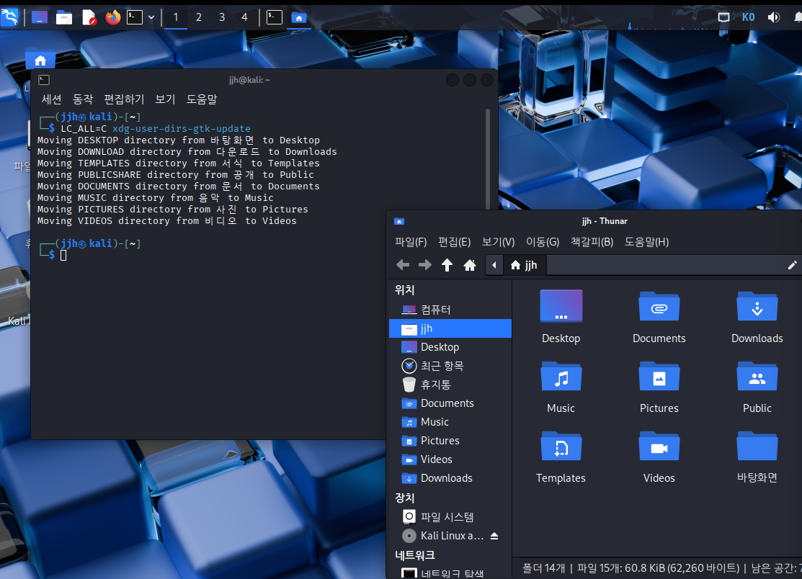

```bash
LC_ALL=C xdg-user-dirs-gtk-update
```

	해당 명령어를 입력하면 업데이트 클릭하면 영어로 바뀐다.