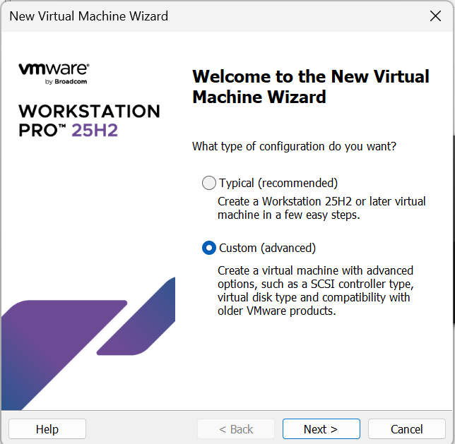
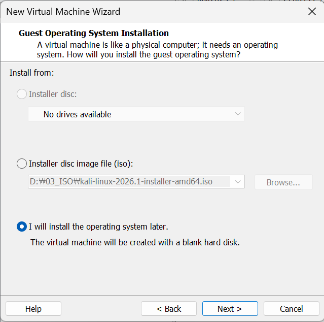
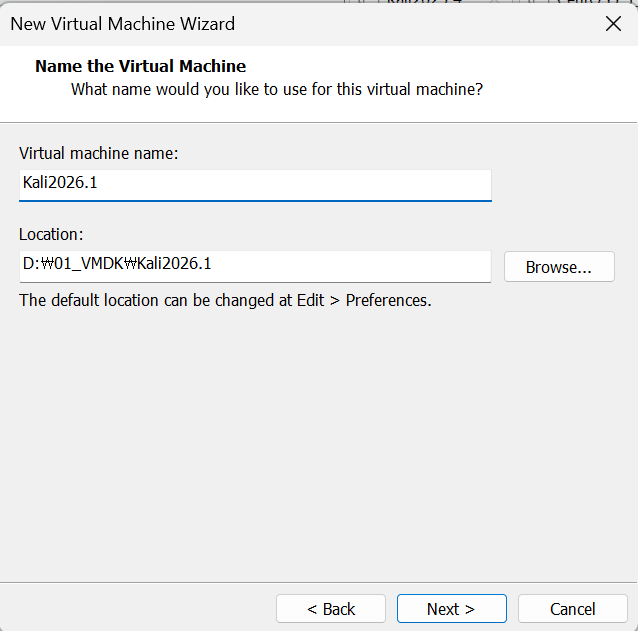
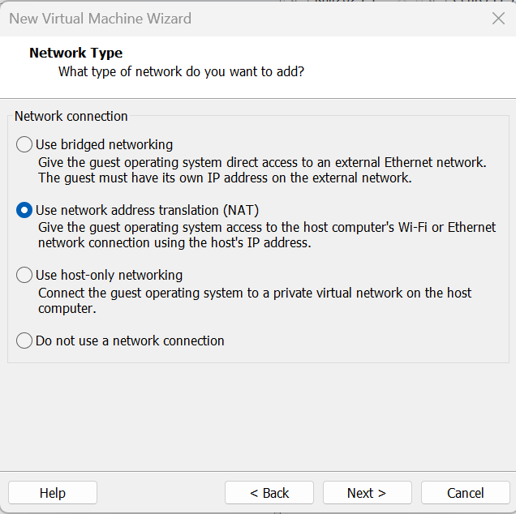
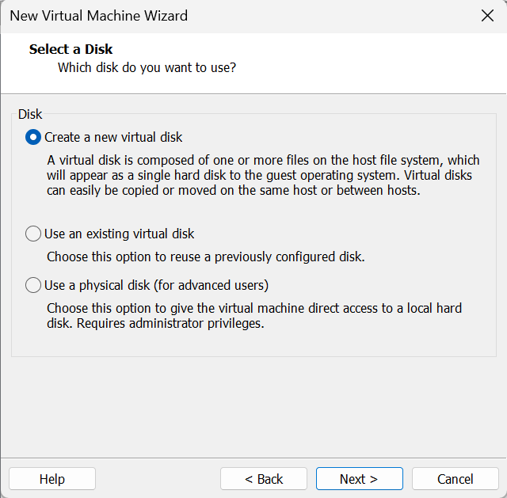
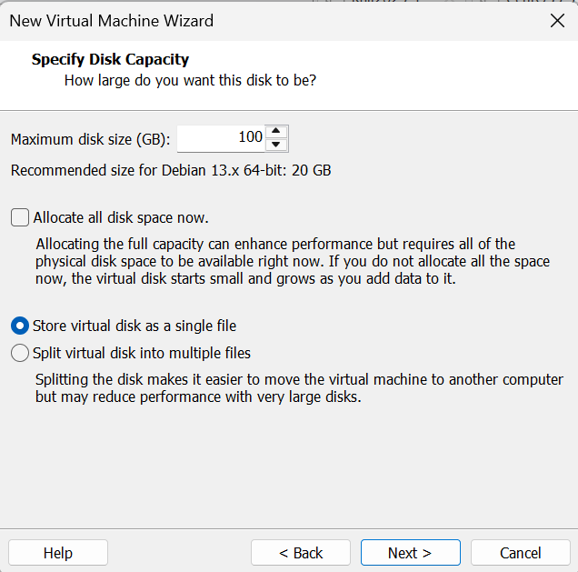

---
## Kali Linux 2026.1 설치 가이드 <1>

	VMware에서 Kali 추가하는 과정

	제일 최신 버전으로 선택

	나중에 iso 넣을 예정

	Kali는 Debian 계열이기 때문에 Debian 중 최신으로 선택

	원하는 경로를 지정해서 칼리 설치

	코어 수는 4~6개 추천

	pc의 메모리가 16기가면 4기가로, 32기가면 8기가로 넉넉하게 주기

	용량이 꽤 많이 필요하므로 넉넉하게 100기가로 설정
	밑에 single file로 변경해서 선택하기

	VMware에서 Kali 추가 완료료