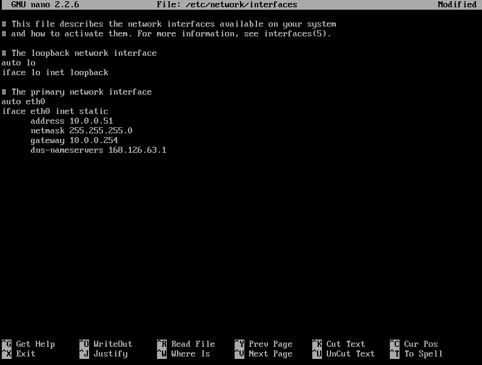
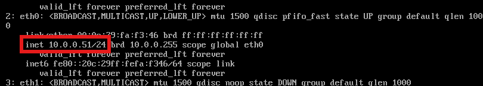

---
## Metasploitable3-ub1404 설정

	user: vagrant / pw: vagrant





```bash
sudo nano /etc/network/interfaces
sudo ifdown eth0 && ifup eth0

reboot

ip a
```

	수정 뒤에는 Ctrl+O -> Enter -> Ctrl+X
	부팅 하고 ip a 명령어를 쳤을 때 설정한 ip로 변경되어 있으면 성공

