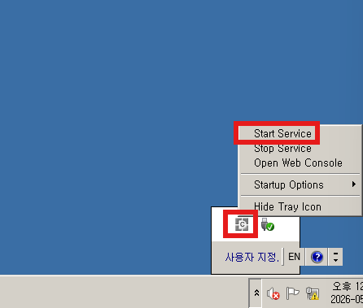
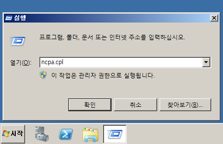
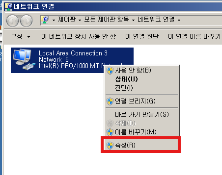
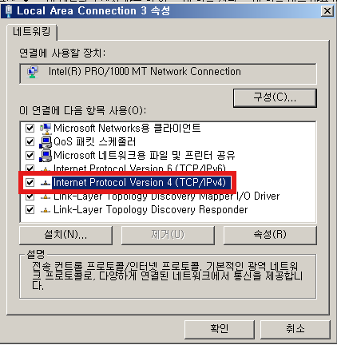
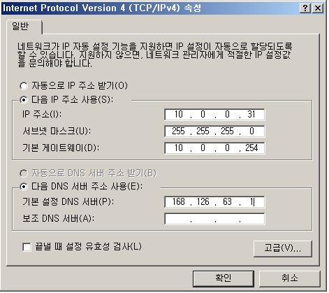

---
## Metasploitable3-windows2008 설정

	user: vagrant / pw: vagrant

	vagrant로 로그인 후 서비스를 시작해준다
	여기에도 취약점이 존재하기 때문

	Win+R 로 ncpa.cpl 을 입력해 네트워크 연결을 실행시켜준다.

	우클릭해서 속성을 클릭하면 버전4(IPv4) 부분이 보일텐데 더블클릭 해준다.

	네트워크를 다음과 같이 세팅해주면 끝이다.