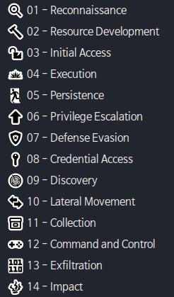
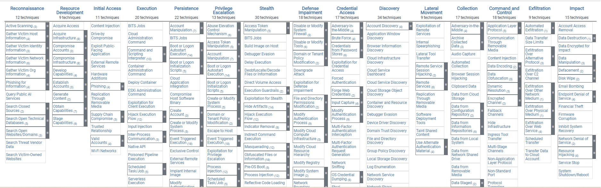
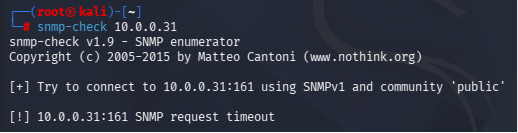

---
**칼리 설치**

	apt autoremove -y fcitx5 fcitx5-hangul






	Kali의 목차는 MITRE ATT&CK의 목차와 완벽하게 일치한다.


**모의 침투 테스트 절차**

	1. 탐색
	2. 정보 수집 - Maltego, shodan, NMAP


**NMAP**

```bash
nmap -sT -v -O -p0-65535 10.0.0.31 > metas3.txt
```

	0-65535까지 tcp인 모든 포트 탐색
	리디렉션 기호로 탐색 결과를 꼭 저장해주는게 좋음
	

```bash
snmp-check 10.0.0.31
```




	해결방법
	public -> 다른이름 으로 변경


nmap --script ftp-brute.nse 10.0.0.31

nmap --script smb-vuln* 10.0.0.31


---
metas3
pass.txt
user.txt

생성 후 공격 진행

**ftp**
```bash
hydra -L user.txt -P pass.txt ftp://10.0.0.31

medusa -U user.txt -P pass.txt -h 10.0.0.31 -M ftp
```

**ssh**
```bash
hydra -L user.txt -P pass.txt ssh://10.0.0.31
```

netstat -na


---
**플래그 획득**


	숨겨진 파일을 찾아내는 과정
	해당 실습에서는 16진수로 이루어진 png파일을 사이트의 개발자모드에서 찾아내 헥사값 
	변환을 시킨 후 플래그를 찾아냄


---

**실습**

1. 첫 번째 rocky9-1 초기화
2. vsftpd 설치
3. 계정은 알파벳 5글자로 생성
4. 패스워드는 모든 숫자, 알파벳, 특수기호 3글자로만
5. mode passive
6. portforwarding
7. 팀원끼리 모의침투 테스트 수행


j0509
o0@


crunch 1 5 /usr/share/rainbowc/char

loweralpha-numeric

ascii-32-95


apt install -y gvm postgresql
systemctl start postgresql
pg_upgradecluster 17 main
gvm-setup

apt install -y metasploit-framework